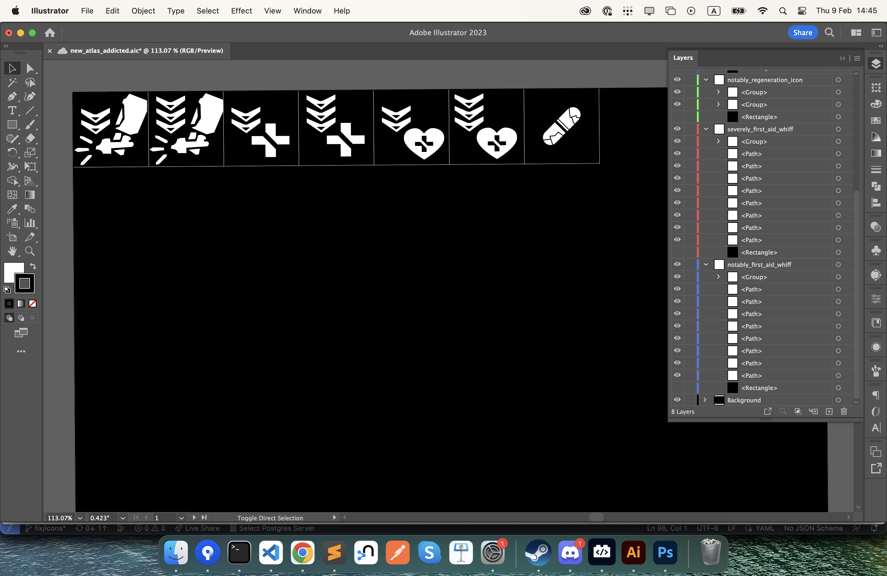
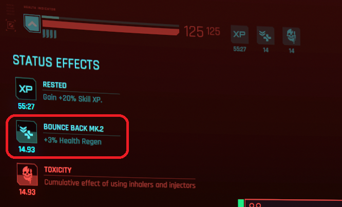

# Icons

Here's a workflow for custom status effects icons which works !

- WolvenKit 8.8.1
- Illustrator 2023
- Photoshop 2023
- InkAtlas Utils 0.6.0

## design in Illustrator (optional)

A good way to design in illustrator is to split each icon in a separate artboard, named after the final icon.
> Each artboard can contain one or more layers for a single icon design.
>

- create new document
  - 640x512 pixels
  - 72 DPI
- create a black background for the whole icons (640x512 pixels) on a "Background" layer
- name each of the layers and their corresponding artboard after its final icon
   e.g. *notably_first_aid_whiff*
- create a black background rectangle for each icon (64x64 pixels) to use as placeholder



Once happy with your icons:

- *File* > *Export* > *Export for Screens*
  
  export them e.g. to *raw\addicted\gameplay\gui\widgets\healthbar*

  

## import into Photoshop

If you chose to design on Illustrator:

- create a new document:
  - 640x512 pixels
  - 72 DPI
- create a black background layer "Background" and lock it
- import and position each of the previously generated PNG icons to your document
- create as many black backgrounds layers as there are icons, named after the icons
  > these are placeholders so that Inkatlas Utils plugin generate Part Mapping of 64x64 pixels, inside of the size of the inner icon's graphics
- group all your icons layers together, and below all the placeholders together


## export from Photoshop

⚠️ if you use a Cloud document
  - File > Save as Copy > On your computer
  - then do the following steps **from your local copy**, because sometimes cloud sync will leave your document in a wrong state after playing batch actions with the plugin

Then proceed:

- open Inkatlas Utils from *Plugins* panel
- *Export to TGA*, e.g.
  - `100`: *raw\addicted\gameplay\gui\widgets\healthbar\atlas_addicted.xbm*
  - `50` (for 1080p): *raw\addicted\gameplay\gui\widgets\healthbar\atlas_addicted_1080p.xbm*
- *Generate InkAtlas*, e.g.
  - InkAtlas filename: *atlas_addicted*
  - XBM Depot Path: *addicted\gameplay\gui\widgets\healthbar\atlas_addicted.xbm*
  - XBM Depot Path (1080p): *addicted\gameplay\gui\widgets\healthbar\atlas_addicted_1080p.xbm*


## import in WolvenKit

- launch WolvenKit
  - *Tools* > *Import Tool*
    - import both .tga as follow

      
  - right click on *raw\addicted\gameplay\gui\widgets\healthbar\atlas_addicted.inkatlas.json* then *Convert from JSON*
  - double-check your *.inkatlas* to make sure everything looks as expected

    

## consume in your mod

- open your IDE
  - edit your YAML Tweak, e.g.
    ```swift
    UIIcon.NotablyWeakenedFirstAidWhiff:
     $type: UIIcon_Record
     atlasPartName: notably_first_aid_whiff
     atlasResourcePath: addicted\gameplay\gui\widgets\healthbar\atlas_addicted.inkatlas
    ```
  - use in your tweaks, e.g.
    ```swift
    BaseStatusEffect.NotablyWeakenedFirstAidWhiffV0:
     $base: BaseStatusEffect.FirstAidWhiffV0
     uiData:
       $base: BaseStatusEffect.FirstAidWhiffV0_inline4
       iconPath: NotablyWeakenedFirstAidWhiff
    ```

Enjoy sweet and sharp icons !


